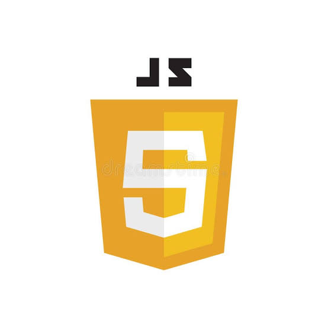

<!DOCTYPE html>
<html lang="en">
<head>
  <meta charset="UTF-8" />
  <meta name="viewport" content="width=device-width, initial-scale=1.0" />
  <title>Jeeva S – Web Developer Portfolio</title>
  <link href="https://fonts.googleapis.com/css2?family=Poppins:wght@300;500;700&display=swap" rel="stylesheet" />
  <link rel="icon" href="favicon.ico" type="image/x-icon" />
  
</head>
<body>
  <header>
    
    <h1>Jeeva S</h1>
    
 Web Developer 

  </header>

  <section class="about">
    <h2>About Me</h2>
    

      I am a passionate learner with a strong interest in web development, eager to build a career in the field of
      information technology and web development. Seeking a challenging position in IT where I can apply my skills in
      web development and grow professionally.
    

  </section>

  <section class="skills">
    <h2>Skills</h2>
    

      
        
        <a href="https://developer.mozilla.org/en-US/docs/Web/HTML">HTML</a>
      
      
        
        <a href="https://developer.mozilla.org/en-US/docs/Web/CSS">CSS</a>
      
      
        
        <a href="https://developer.mozilla.org/en-US/docs/Web/JavaScript">JavaScript</a>
      
      
        
        <a href="https://www.canva.com/">Canva</a>
      
    

    

      I have a strong foundation in HTML, CSS, and JavaScript, with experience in creating responsive and user-friendly
      web applications. I am also proficient in using design tools like Canva for creating visually appealing designs.
    

  </section>

  <section class="projects">
    <h2>Projects</h2>
    

      <h3>Resume Website</h3>
      

        Created a personal resume website to showcase my academic and professional details, skills, and projects.
      

      <a href="https://jeevas07.github.io/Resume/" target="_blank">View Project</a>
    

    

      <h3>Blood Bank & Donor Management System</h3>
      

        Developed as a college project, this system manages donor details, blood group availability, and donation
        records.
      

    

  </section>

  <section class="contact">
    <h2>Contact</h2>
    <a href="mailto:sj160189@gmail.com">sj160189@gmail.com</a>
    <a href="tel:+917339106440">+91 73391 06440</a>
    <a href="https://www.linkedin.com/in/jeeva-s7-531a0b352" target="_blank">LinkedIn Profile</a>
  </section>

  <footer>
    
© 2025 Jeeva S. All rights reserved.

  </footer>
</body>
</html>
